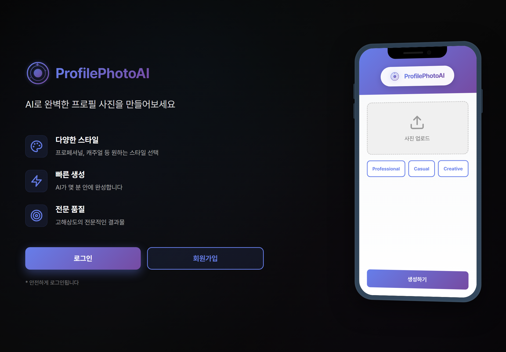
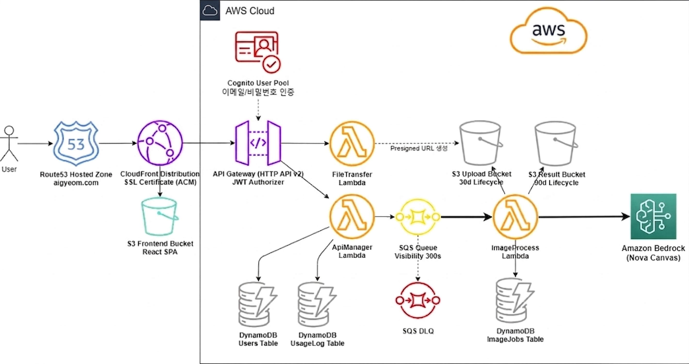

# ProfilePhotoAI

AWS Bedrock Nova Canvas 기반 AI 프로필/증명사진 생성 서비스입니다.

## 프로젝트 소개

ProfilePhotoAI는 사용자가 원본 사진을 업로드하면 취업용 프로필 사진이나 증명사진 스타일로 변환해 주는 서버리스 웹 서비스입니다.
단순히 AI 모델을 호출하는 데모가 아니라, 인증된 사용자가 업로드부터 생성 요청, 결과 조회와 다운로드까지 실제 서비스 흐름으로 사용할 수 있도록 구현했습니다.

- 프론트엔드: React
- 인프라: API Gateway, Lambda, SQS, S3, DynamoDB, Cognito, CloudFront
- 이미지 생성: Amazon Bedrock `amazon.nova-canvas-v1:0`
- 인프라 관리: Terraform

## 문제 정의

AI로 프로필 사진을 생성하는 기능 자체보다 어려운 문제는, 이를 비용과 운영을 고려한 웹 서비스로 완성하는 것이었습니다.

- 사용자가 업로드한 이미지를 애플리케이션 서버를 거치지 않고 안전하게 저장해야 했습니다.
- 이미지 생성은 지연 시간이 길 수 있어 동기 API로 처리하면 사용자 경험과 안정성이 떨어집니다.
- 모델 호출 비용이 큰 만큼 사용자별 사용량 제한과 실패 복구 전략이 필요했습니다.
- 결과 이미지를 안전하게 내려주되, 스토리지 경로를 직접 노출하지 않는 방식이 필요했습니다.

## 핵심 기능

- Cognito 기반 회원가입/로그인과 인증된 사용자 전용 API 접근 제어
- 브라우저에서 S3로 직접 업로드하는 presigned POST 기반 파일 업로드
- JPG, PNG, WEBP 업로드 지원과 데스크톱 웹캠 촬영 지원
- 취업/증명사진 용도에 맞춘 10개 스타일 프리셋과 커스텀 프롬프트 입력
- 생성 요청 후 작업 상태 폴링, 생성 이력 조회, 결과 이미지 다운로드 제공
- 사용자별 일일 생성 횟수 관리와 quota 초과 시 요청 차단

## 아키텍처 및 설계 고려사항

### 1. 업로드 보안과 파일 소유권 검증

업로드 서버를 직접 두지 않기 위해 S3 presigned POST 방식을 선택했습니다. 대신 `POST /generate` 단계에서 현재 로그인한 사용자의 `fileKey` prefix를 다시 검증하고, 실제 S3 객체 존재 여부까지 확인해 다른 사용자의 파일을 참조하지 못하도록 막았습니다.

### 2. 긴 이미지 생성 시간을 고려한 비동기 처리

이미지 생성은 응답 시간이 짧지 않고 실패 가능성도 있기 때문에 API Gateway가 직접 처리하지 않도록 분리했습니다. API는 job 생성과 큐 적재까지만 담당하고, 실제 생성은 SQS를 소비하는 Lambda가 Bedrock Nova Canvas를 호출하는 구조로 설계해 응답성과 안정성을 분리했습니다.

### 3. 비용 제어를 위한 quota 일관성 처리

모델 호출 비용이 높은 서비스이기 때문에 사용자별 일일 quota를 두었습니다. DynamoDB 조건식 기반 원자 업데이트로 quota를 차감하고, 큐 적재가 실패하면 quota를 다시 복구하도록 처리해 사용량 데이터가 틀어지지 않도록 만들었습니다.

### 4. 결과 전달과 운영 단순화

생성 결과는 S3에 저장하되, 다운로드 시점에만 presigned URL을 발급하도록 구성했습니다. 이 방식으로 버킷을 직접 공개하지 않으면서도 결과 전달을 단순하게 유지했고, 전체 인프라는 Terraform으로 관리해 dev/prod 환경을 재현 가능하게 정리했습니다.
